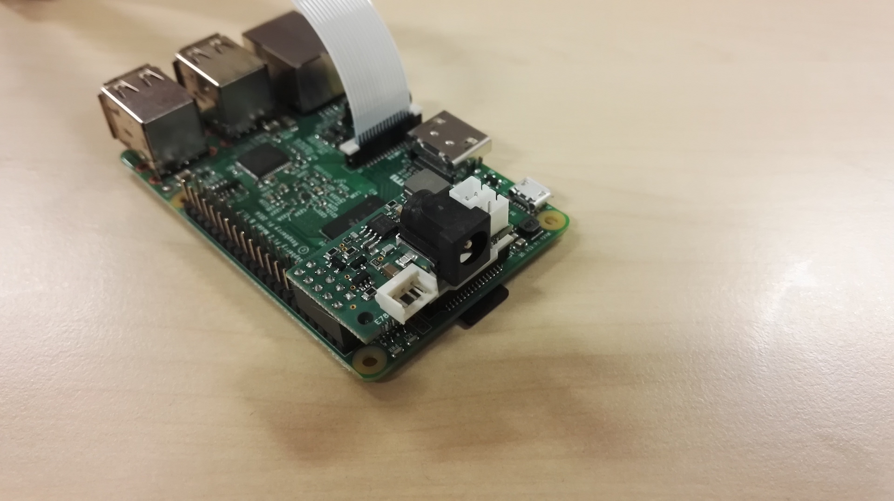
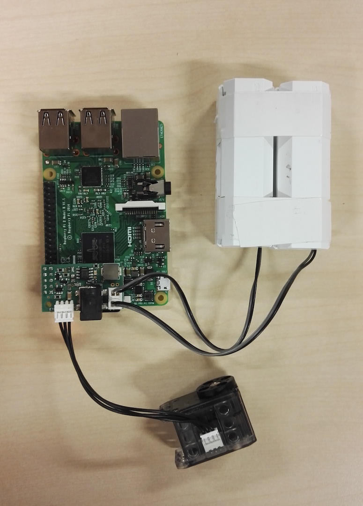

# pixl
Pixl is a small board made for using Dynamixel XL-320 motors on a Raspberry Pi.
The board is made with [circuitmaker](http://www.circuitmaker.com), a EDA software tool from Altium available as freeware for any kind of projects.

To modify the board or export the last production files, [follow this link](http://workspace.circuitmaker.com/Projects/78A4FE38-92CD-4DAB-9B5A-15E9EAD0FAC1). An account on CircuitMaker is needed to download documents.

This GitHub repository is only made for keeping a copy of productions files without having to log in circuit maker.

## Features
* It powers up the Raspberry Pi from the 7,5V motor power with an embedded voltage converter.
* It provides a conversion from the 5V TTL half duplex bus of Dynamixel motors from the 3.3V UART ports of the Raspberry Pi.
* You can power up your motors and the Raspberry Pi from a 7.5V as well as with Robotis batteries (LBB-040).

## Mounting
The pixel board plugs into the pins 1 to 10 off the raspberry pi, please make sure the hole of the pixel is aligned to that of the raspberry pi, like that :

 To power up your system you have the black Jack connector as power input (2,1 mm, 5,5 mm) designed for an external power supply able to output 7.5V at least 2A ([ECP-15-7.5E](http://fr.rs-online.com/web/p/alimentations-enfichables/7262814/?searchTerm=7262814&relevancy-data=636F3D3126696E3D4931384E525353746F636B4E756D6265724D504E266C753D656E266D6D3D6D61746368616C6C26706D3D5E5C647B367D247C5E5C647B377D247C5E5C647B31307D2426706F3D313426736E3D592673743D52535F53544F434B5F4E554D4245522677633D4E4F4E45267573743D37323632383134267374613D3732363238313426)), or you can plug your LBB-040 battery holder on the twice two pins connector like that :

## Precautions
* **You need to swith off the power supply of the pixl before to put in or to take off the pixl of the Raspberry pi**. Otherwise, there is a small risk to burn the power converter of the pixl board.
* **Do not use batteries in addition to DC plug.**
* **Do not reload batteries plugged on the pixel, please unmount it before recharging.**

## Limitation
This board has been designed to drive 6 motors, **we don't provide the proper functioning of the communication protocol with more than 6 devices**.

## Contributing
You can share your experience, new design, ideas or questions on the [Poppy project forum](https://forum.poppy-project.org/).

## Licence
This board is licenced under the [Creative Commons Attribution-ShareAlike 3.0](https://creativecommons.org/licenses/by-sa/3.0/) (CC-BY-SA) licence.
